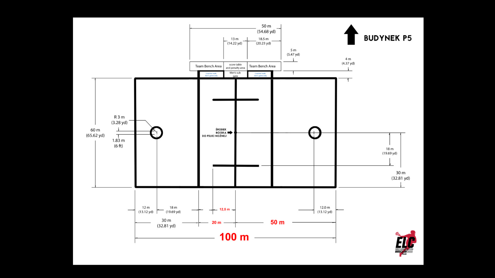

# Coaches Meeting Presentation

===

## Content

* RIC Team
* New Faceoff Mechanic
* Over & Back
* Quick Restarts
* Field Dimensions
* Other Conditions

====

## RIC Team

===

### Anreas Maertens - RIC

 <!-- .element: class="teampic" -->

Phone: [+49 162 235 7892](phone:+491622357892)

 <!-- .element: class="teampic" -->

===

### Jasper Van Der Horst - Deputy RIC

 <!-- .element: class="teampic" -->

===

### Philip Pearson - Deputy RIC

 <!-- .element: class="teampic" -->

===

## RIC Team

 <!-- .element: class="teampic" -->
 <!-- .element: class="teampic" -->
 <!-- .element: class="teampic" -->

 <!-- .element: class="teampic" -->

ecreferees@gmail.com

====

## Faceoff

===

* No rules changes
* Officials mechanics changed <!-- .element: class="fragment" -->
    * 2 Officials at the face <!-- .element: class="fragment" -->
    * 1 Official at Bench-Side <!-- .element: class="fragment" -->

====

## Rule 61.18 - Over and Back

===

once ball in attack goal area it shall not return to defensive half

===

violation leads to immediate turnover with quick restart

===

No Over and Back when ball over center line and:
+ it's a shot hitting the goalpipe <!-- .element: class="fragment" -->
+ loose ball last touched by defense <!-- .element: class="fragment" -->
+ loose ball violation by defense (play-on) <!-- .element: class="fragment" -->

====

## Rule 37 Restarts

===

On restart a defense cannot "defend the ball" until 5 yards from the awarded Player during live ball

"defending the ball" means defending against player awarded restart while "personal possession" <!-- .element: class="fragment" -->

with losing "personal possession" the restrain ends <!-- .element: class="fragment" -->

===

violation is illegal procedure

===

Non-Quick Restart when:

+ within 5 yards of the gate of the Substitution area <!-- .element: class="fragment" -->
+ inside Attack Goal Area <!-- .element: class="fragment" -->
+ within 20 yards of either Goal <!-- .element: class="fragment" -->
+ teammate within 5 yards <!-- .element: class="fragment" -->
+ not in same relative field position <!-- .element: class="fragment" -->
+ referees flag is on the field <!-- .element: class="fragment" -->
+ injured player on field <!-- .element: class="fragment" -->

====

## Field Dimensions

====

## Other Conditions

* Official Gametime is that of the Timekeeper at the Table <!-- .element: class="fragment" -->
* Final Score is that of the Head Official <!-- .element: class="fragment" -->
* There is no Stick-Check after sudden victory goal <!-- .element: class="fragment" -->

====

## Questions?

====

## Rules

[Mens Rules 2021 - 23 - May](https://d13mgad1aost97.cloudfront.net/2021/05/Mens-Rules-2021-23-May-2021-V1.0-1.pdf)
